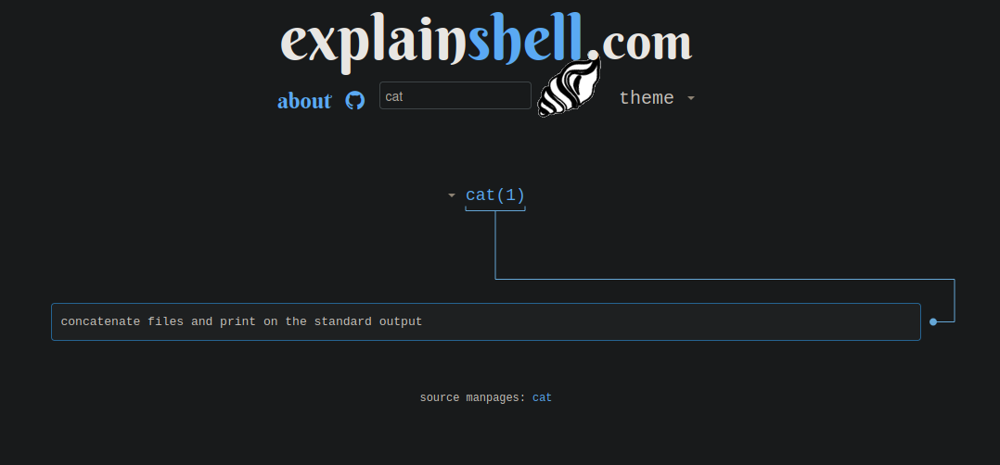
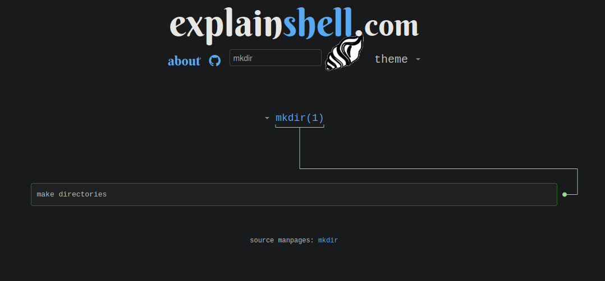
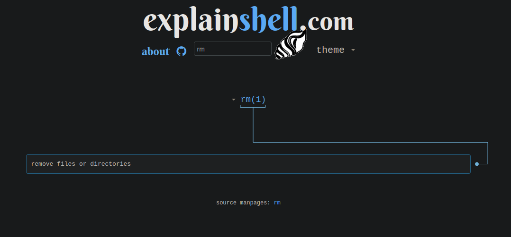

# Les commandes de base sous Linux : Ce qui se passe sous le capot

Bienvenue dans cette chronique spécialement dédiée aux futurs experts en systèmes et réseaux, notamment les courageux étudiants en **TSSR**. Si vous commencez tout juste à vous familiariser avec l'univers mystérieux et parfois intimidant de la ligne de commande (oui, ce fameux écran noir qui vous fixe), ne vous inquiétez pas, on est tous passés par là.

### La ligne de commande ? Toute noire et un peu flippante ?


**N'ayez pas peur, la ligne de commande n'a jamais mangé personne... enfin, presque !**

Pas de panique ! Ici, on dédramatise ! La ligne de commande, c'est comme un vélo : une fois que vous avez appris à pédaler, vous n'avez plus peur de tomber. On va explorer ensemble ce qui se cache derrière des commandes comme `ls`, `cd`, ou `rm` et je vous promets que ça ne mord pas. Allez, accrochez-vous, c'est parti pour une aventure (sans danger) dans les tréfonds de Linux ! Et rappelez-vous : **personne n'a jamais été mangé par un shell**... enfin, presque.

## 1. La commande `cd`

La commande `cd` (change directory) permet de naviguer dans les répertoires du système de fichiers.

### Ce que fait réellement la commande `cd` :

- **Changer de répertoire** : `cd` permet de naviguer d'un répertoire à un autre, mais contrairement à un clic sur une icône dans une interface graphique, ici c'est le **shell** (bash, zsh) qui modifie son répertoire de travail. Il appelle une fonction du noyau appelée `chdir()` pour définir un nouveau répertoire comme répertoire courant.
- **Impact sur les processus** : Cela signifie que toutes les commandes exécutées ensuite vont opérer depuis ce nouveau répertoire, jusqu'à ce que vous changiez à nouveau de répertoire.

Voici une explication visuelle détaillée de la commande `cd` via ExplainShell :


_Crédit image :_ [ExplainShell](https://explainshell.com/explain?cmd=cd)

### Exemple d'utilisation de `cd` :

```bash
# Se déplacer dans le répertoire "Documents"
cd Documents

# Revenir au répertoire parent
cd ..

# Aller directement dans le répertoire personnel
cd ~

# Revenir au répertoire précédent
cd -
```

## 2. La commande `ls`

La commande `ls` permet d'afficher le contenu d'un répertoire.

### Ce que fait réellement la commande `ls` :

- **Lire le contenu du répertoire** : Lorsque vous exécutez `ls`, le shell envoie une requête au système de fichiers en utilisant l'appel système `readdir()` pour lister les fichiers et répertoires. En réalité, chaque fichier ou répertoire est stocké avec un certain nombre de métadonnées (permissions, tailles, dates) que le système va également récupérer si nécessaire.
- **Formatage des résultats** : Le résultat est ensuite formaté pour être affiché dans le terminal. Si vous utilisez des options comme `ls -l`, le shell appelle aussi d'autres fonctions comme `stat()` pour récupérer les permissions et la taille des fichiers.

Voici un exemple de l'utilisation de la commande `ls` dans un terminal :


_Crédit image :_ [ExplainShell](https://explainshell.com/explain?cmd=ls)

### Variante : `ls -l`

- **Affichage détaillé** : L'option `-l` indique au shell de récupérer et d'afficher des informations supplémentaires sur chaque fichier, comme les permissions, le propriétaire, le groupe, la taille, et la date de modification. Ces informations sont récupérées via l'appel système `stat()`.


_Crédit image :_ [ExplainShell](https://explainshell.com/explain?cmd=ls+%2Dl)

### Variante : `ls -la`

- **Afficher les fichiers cachés** : L'option `-a` permet d'afficher tous les fichiers, y compris ceux qui sont cachés (fichiers dont le nom commence par un point). Sous le capot, `ls` utilise encore `readdir()` mais sans exclure ces fichiers masqués par défaut.


_Crédit image :_ [ExplainShell](https://explainshell.com/explain?cmd=ls+%2Dla)

### Exemple d'utilisation de `ls` :

```bash
# Lister les fichiers du répertoire courant
ls

# Lister les fichiers avec plus de détails
ls -l

# Lister tous les fichiers, y compris les fichiers cachés
ls -la

# Lister les fichiers d'un répertoire spécifique
ls /home/utilisateur/Documents
```

## 3. La commande `touch`

La commande `touch` permet de créer un fichier vide ou de mettre à jour la date de modification d'un fichier existant.

### Ce que fait réellement la commande `touch` :

- **Créer un fichier vide** : Si le fichier n'existe pas, `touch` crée un fichier vide en appelant `open()` avec une option pour créer le fichier s'il est absent. Le fichier n'a pas de contenu, mais il est bien présent dans le répertoire.
- **Mettre à jour les métadonnées** : Si le fichier existe déjà, `touch` met simplement à jour son horodatage (date de dernière modification) avec les appels système `utime()` ou `futimens()`.

Voici l'explication de la commande `touch` via ExplainShell :


_Crédit image :_ [ExplainShell](https://explainshell.com/explain?cmd=touch)

### Exemple d'utilisation de `touch` :

```bash
# Créer un nouveau fichier vide
touch nouveau_fichier.txt

# Mettre à jour la date de modification d'un fichier existant
touch fichier_existant.txt

# Créer plusieurs fichiers à la fois
touch fichier1.txt fichier2.txt fichier3.txt
```

## 4. La commande `cat`

La commande `cat` (concatenate) permet de visualiser le contenu d'un fichier.

### Ce que fait réellement la commande `cat` :

- **Afficher le contenu d'un fichier** : Lorsque vous exécutez `cat`, le fichier est ouvert avec `open()`, lu avec `read()`, puis affiché dans le terminal avec `write()`. La commande `cat` est très simple dans son fonctionnement, mais elle est incroyablement utile pour voir le contenu des fichiers texte.

Voici l'explication de la commande `cat` :



_Crédit image :_ [ExplainShell](https://explainshell.com/explain?cmd=cat)

### Exemple d'utilisation de `cat` :

```bash
# Afficher le contenu d'un fichier
cat mon_fichier.txt

# Concaténer et afficher le contenu de plusieurs fichiers
cat fichier1.txt fichier2.txt

# Créer un nouveau fichier avec du contenu
cat > nouveau_fichier.txt
Ceci est le contenu du nouveau fichier.
[Ctrl+D pour terminer]

# Ajouter du contenu à la fin d'un fichier existant
cat >> fichier_existant.txt
Ajout de nouveau contenu.
[Ctrl+D pour terminer]
```

## 5. La commande `mkdir`

La commande `mkdir` permet de créer un nouveau répertoire.

### Ce que fait réellement la commande `mkdir` :

- **Créer un nouveau répertoire** : `mkdir` crée un nouveau dossier dans le système de fichiers avec l'appel système `mkdir()`. Cela signifie qu'un nouvel inode (structure de données représentant le répertoire) est créé et associé à son emplacement dans le système de fichiers.

Voici l'explication de la commande `mkdir` :



_Crédit image :_ [ExplainShell](https://explainshell.com/explain?cmd=mkdir)

### Exemple d'utilisation de `mkdir` :

```bash
# Créer un nouveau répertoire
mkdir nouveau_repertoire

# Créer plusieurs répertoires à la fois
mkdir dossier1 dossier2 dossier3

# Créer une structure de répertoires imbriqués
mkdir -p parent/enfant/petit-enfant

# Créer un répertoire avec des permissions spécifiques
mkdir -m 755 repertoire_avec_permissions
```

## 6. La commande `rm`

La commande `rm` permet de supprimer des fichiers ou répertoires.

### Ce que fait réellement la commande `rm` :

- **Supprimer un fichier** : `rm` utilise l'appel système `unlink()` pour retirer le fichier de son répertoire. Si le fichier est un lien vers des données sur le disque, ces données ne seront supprimées que lorsque plus aucun lien n'y fait référence.
- **Supprimer un répertoire** : Lorsque vous utilisez `rm -r` pour supprimer un répertoire, `rm` va de manière récursive appeler `unlink()` sur chaque fichier et sous-répertoire pour s'assurer que tout le contenu est supprimé.

Voici l'explication de la commande `rm` :



_Crédit image :_ [ExplainShell](https://explainshell.com/explain?cmd=rm)

### Exemple d'utilisation de `rm` :

```bash
# Supprimer un fichier
rm fichier_a_supprimer.txt

# Supprimer plusieurs fichiers
rm fichier1.txt fichier2.txt fichier3.txt

# Supprimer un répertoire vide
rmdir repertoire_vide

# Supprimer un répertoire et son contenu (attention, utiliser avec précaution)
rm -r repertoire_et_contenu

# Supprimer un fichier en demandant confirmation
rm -i fichier_important.txt

# Forcer la suppression sans demander de confirmation (à utiliser avec extrême prudence)
rm -f fichier_protege.txt
```

## Conclusion

Ces commandes de base ne sont plus un mystère pour vous, et j'espère que cette petite excursion dans les entrailles de Linux vous a rassurés. La ligne de commande n'est finalement pas si intimidante, n'est-ce pas ? Avec un peu de pratique (et d'humour 😄), vous verrez que même le shell peut devenir votre meilleur ami.

---

**Crédits** :  
Certaines explications visuelles des commandes ont été fournies par [ExplainShell](https://explainshell.com/).
